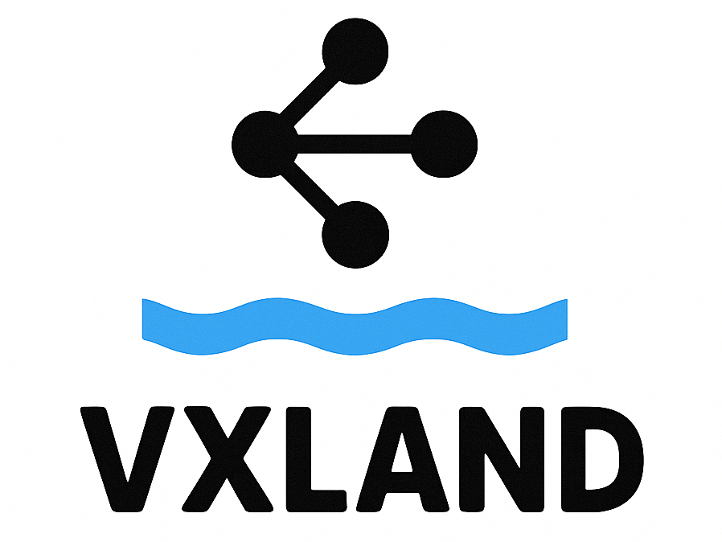

# VXLAND Lab

<p align="left">
  
</p>


VXLAND is a modular, automation-driven lab environment for testing **OVN-Kubernetes** and related infrastructure components.  
It is designed to quickly spin up a fully functional environment using **Ansible**, **Libvirt**, and supporting shell scripts.

---

## 📂 Directory Structure

- **deploy/** – Main deployment logic, organized into modular stages:
  - **00-vms/** – VM creation, base networking setup (Libvirt XML, basic OVN network, nftables segments)
  - **02-freeipa/** – Automated FreeIPA installation & configuration (Ansible roles and templates)
  - **03-build/** – Post-install configuration for base systems
  - **04-registry/** – Container registry setup (including UI and image preloading)
  - **05-k8s/** – Kubernetes cluster deployment (masters, workers) with OVN-Kubernetes manifests
  - **99-global/** – Global variables and shared includes
  - **99-newhost/** – Templates, default configs, and repos for new hosts

- **contrib/** – (Reserved for) Additional helper scripts, external tools, and experimental code

- **scripts/** – Miscellaneous helper scripts for managing or troubleshooting the lab

---

## 🚀 Getting Started

### Requirements
- **Linux host** with Libvirt and Ansible installed
- At least **4 CPU cores**, **8 GB RAM**, and **50 GB free disk space** (minimum for small lab)
- Network access for pulling container images and packages

### Quick Start
```bash
cd deploy/00-vms
./04_ovn_network.sh
./06_nftables_bsegment.sh
# Adjust vxland.xml if needed for your Libvirt network
```

Then proceed through each deployment stage:
```bash
cd ../02-freeipa/ansible
ansible-playbook 01_prepare_nodes.yaml
ansible-playbook 02_install_ipa.yaml

# Continue with 03-build, 04-registry, and finally 05-k8s
```

---

## 🛠 Roadmap
- [ ] Detailed documentation for each deployment stage
- [ ] Automated end-to-end deployment script
- [ ] OVN-Kubernetes advanced features demos (Egress IP, NetworkPolicy, ExternalRoutes)
- [ ] Optional integrations (Vault, Keycloak, etc.)

---

## ⚠ Disclaimer
This lab is intended for **testing and learning purposes** only.  
Do not use in production environments.

---
